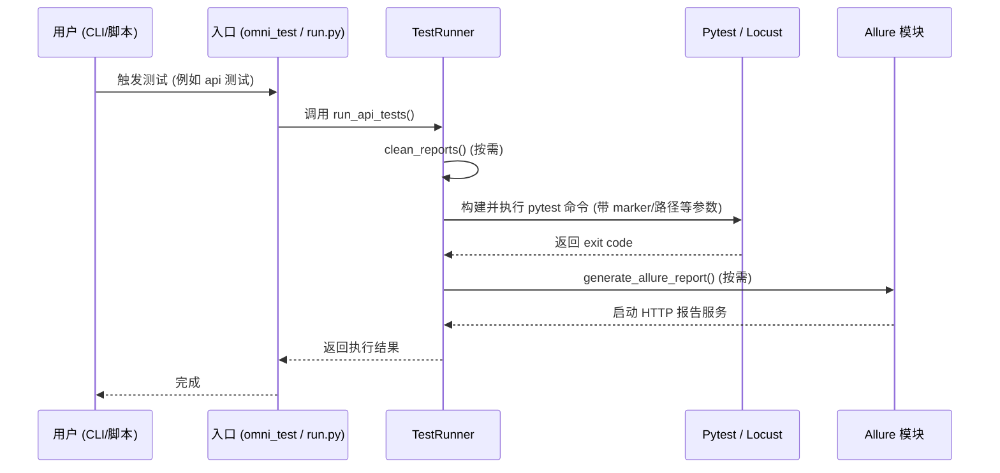

# OmniTest 项目全景文档

## 1. 项目概述

OmniTest 是一个一体化的自动化测试框架，支持 **API 测试**、**Web UI 测试**、**APP 测试** 以及 **性能测试**。该框架旨在为测试团队提供一个低门槛、高可扩展的测试平台，既支持通过简洁的命令行直接触发测试，也提供了对开发者友好的 Python 编程 API（支持链式调用）。

### 设计哲学
- **统一入口**：无论执行哪种类型的测试，都通过统一的 CLI 或 API 触发，降低认知负担。
- **数据驱动**：支持灵活的数据管理和环境配置（YAML），使得测试用例与测试数据分离。
- **开箱即用**：自动化的日志管理、Allure 报告生成与服务启动、以及环境清理功能。

---

## 2. 项目架构与业务流程

### 2.1 整体架构图

```mermaid
graph TD
    subgraph 入口层 [入口层 (Entry Points)]
        CLI[命令行 CLI: run.py / main.py]
        API[编程 API: omni_test.py]
    end

    subgraph 调度层 [调度层 (Runner & Dispatcher)]
        Runner[TestRunner: run.py（Facade）]
        CoreRunner[核心执行器: utils/runner]
        Reporting[报告模块: utils/reporting]
        Runner -->|分发| Pytest[Pytest 引擎]
        Runner -->|分发| Locust[Locust 引擎]
    end

    subgraph 测试用例层 [测试用例层 (Test Cases)]
        APICase[API 测试用例]
        WebCase[Web 测试用例]
        AppCase[App 测试用例]
        PerfCase[性能测试用例]
    end

    subgraph 核心能力模块 [核心能力与支持 (Core Utils)]
        Config[配置中心 config_manager]
        Log[日志管理 logger_util]
        Path[路径管理 path_util]
        DB[数据库客户端 DB Client]
        WebAPP[Web/App 驱动管理]
    end

    subgraph 报告与输出层 [报告输出 (Reporting)]
        Allure[Allure 结果收集与报告生成]
        Console[控制台日志输出]
    end

    %% 关联
    CLI --> Runner
    API --> Runner
    Runner -.-> CoreRunner
    Runner -.-> Reporting
    
    Pytest --> APICase
    Pytest --> WebCase
    Pytest --> AppCase
    Locust --> PerfCase
    
    APICase -.-> 核心能力模块
    WebCase -.-> 核心能力模块
    AppCase -.-> 核心能力模块
    PerfCase -.-> 核心能力模块
    
    Reporting --> Allure
```

### 2.2 核心模块说明

- **`omni_test.py`**：框架的对外编程 API 入口。采用外观模式（Facade）封装了底层复杂的调度逻辑，提供 `ot` 全局实例，支持 `ot.api().web().report()` 这样的链式调用。
- **`run.py`**：CLI 入口与兼容层，保留 `TestRunner` 对外接口与命令行解析。实际执行/报告/依赖管理能力分别拆分到 `utils/runner`、`utils/reporting`、`utils/packaging`。
- **`config/config_manager.py`**：支持点号访问（`ConfigDict`）、热重载、环境变量覆盖的灵活配置管理器。
- **`utils/`**：底层支撑能力库（日志、路径、文件、装饰器、数据库、Web/App 驱动等）。
  - `utils/runner/test_runner.py`：pytest/locust 命令构建与执行（包含目标路径解析）
  - `utils/reporting/allure_report.py`：Allure 报告生成、服务化与打开
  - `utils/packaging/requirements_manager.py`：requirements 更新与依赖追加
  - `utils/api/`、`utils/web/`、`utils/app/`、`utils/db/`、`utils/logger/`、`utils/performance/`：按领域划分的能力模块
  - `utils/logger_util.py`、`utils/path_util.py`、`utils/file/`、`utils/assert/`、`utils/common/`、`utils/decorator/`、`utils/notification/`、`utils/screenshot/`：通用工具模块（已完成包化重构）
 - **`tests/baseline/`**：离线基线测试，用于验证导入与对外接口契约，避免重构引入回归。
 - **`pyproject.toml`**：项目构建配置文件，定义包结构、依赖与入口点。

---

## 3. 关键业务流程

### 3.1 测试执行流程 (CLI / API 触发)



### 3.2 配置加载机制

1. **确定环境**：优先读取 `OMNITEST_ENV` 环境变量（默认 `test`）。
2. **加载基础配置**：读取 `config/default.yaml`。
3. **加载环境配置**：读取 `config/{env}.yaml`，深度合并并覆盖基础配置。
4. **环境变量注入**：解析操作系统环境变量（如 `MYSQL_HOST`、以 `API_` / `WEB_` 开头的变量），进行最高优先级的覆盖。
5. **动态访问**：代码中通过 `from config.config_manager import config`，直接以 `config.log.level` 形式获取。

---

## 4. 配置文件说明

所有环境配置文件放置于 `config/` 目录中：
- **`default.yaml`**：全环境通用的兜底配置（超时时间、重试策略、默认报告路径等）。
- **`test.yaml`** / **`prod.yaml`**：针对不同环境特有的配置（如特定的数据库连接、测试账号密码、压测 URL）。
- **`logging.yaml`**：可选的高级日志格式配置文件，可通过 `OMNITEST_USE_LOGGING_YAML=1` 激活。

**配置示例**：
```yaml
log:
  dir: ./logs
  level: INFO

report:
  dir: ./reports
  format: html

mysql:
  default:
    host: 127.0.0.1
    port: 3306
```

---

## 5. 部署与环境要求指南

### 环境依赖
- **Python**: >= 3.8
- **测试框架**: `pytest`, `locust`
- **外部工具**:
  - `Allure Commandline`：必须在系统 PATH 中，用于生成 HTML 报告。
  - `WebDriver`：针对 Web UI 测试，需准备对应浏览器版本的驱动（或依赖 webdriver-manager）。
  - `Appium Server`：针对 APP 测试，须预先在后台启动（默认 `127.0.0.1:4723`）。

### 快速安装
```bash
# 1. 检出代码并进入项目
git clone <url> && cd OmniTest

# 2. 建立虚拟环境并激活
python -m venv .venv
source .venv/bin/activate  # macOS/Linux

# 3. 安装依赖与自身为模块
pip install -r requirements.txt
pip install -e .
```
安装完成后，系统即可直接使用 `omni-test` 命令行指令，或者在任意 Python 脚本中执行 `import omni_test`。

---

## 6. 测试策略与开发规约

1. **职责分离**：
   - 用例逻辑统一写在 `cases/` 目录下。
   - 数据（YAML/JSON）统一放在 `data/test_data/` 下，严禁在用例中硬编码敏感账号。
   - 页面对象（PO 模式）应放在各自用例模块的 `pages/` 目录下。
2. **提交与更新**：
   - 引入新第三方库后，务必使用 `python run.py package update-req` 或 `python run.py package add <pkg>` 来更新依赖，保留注释结构。
3. **断言与排错**：
   - 善用 `logger.info()` 记录关键业务节点。
   - 使用 `utils/assert` 提供的断言工具，失败时能被 Allure 正确捕捉。
4. **全景图更新机制**：
   - 随着项目的模块重构、组件增减或执行流程发生质变时，开发者应当同步更新此 `PROJECT_OVERVIEW.md` 文档。
